# Report for Assignment 1

## Project chosen

Name: discord.py

URL: https://github.com/Rapptz/discord.py

Number of lines of code and the tool used to count it: 68242 using `lizard discord tests setup.py`

Programming language: Python

## Coverage measurement

### Existing tool

The coverage tool [coverage.py](https://coverage.readthedocs.io/en/7.5.3/) was used for this project.
After installing the dependencies and executing `coverage run -m pytest` we get the following output:

Running `coverage html` and opening the document in the browser gives the following:

### Your own coverage tool

#### Thijmen

flatten_literal_params

[commit](https://github.com/tthijm/sep/commit/2afde74ee94eb7e6cdc476356aa41f1ca09d87cf)

\_human_join

[commit](https://github.com/tthijm/sep/commit/88c98ebc05c4d67bcdce7d3046ffa786f79b9284)

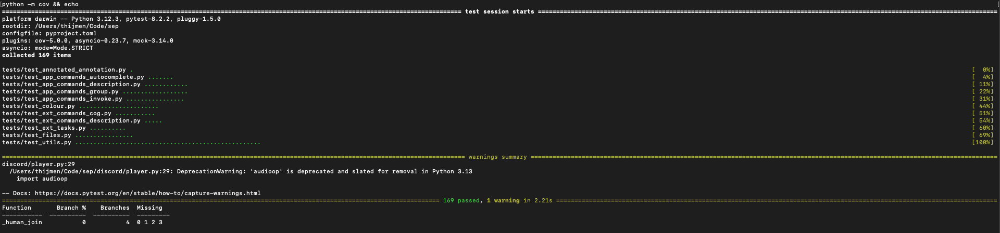

#### Maurice

\_string_width

[commit](https://github.com/tthijm/sep/commit/2a0411b2ed3f982b0b0ad9c6ac99ee4d3210b2dc)

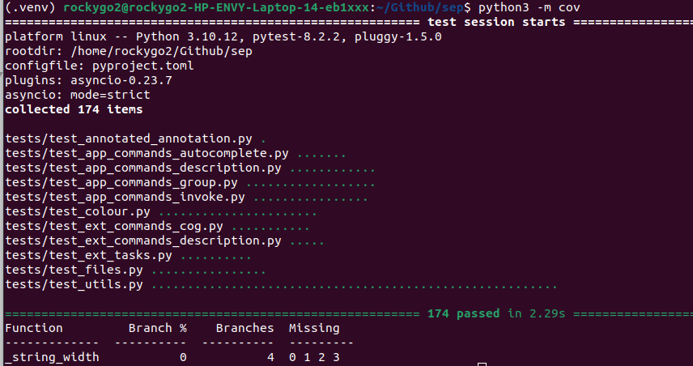

escape_markdown

[commit](https://github.com/tthijm/sep/commit/fa81a81e90b4623bbaf7e9a2ee2d46e4f26556e9)

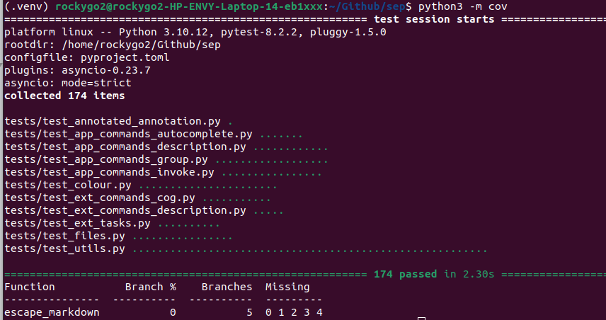

#### Yasin

\_get and \_aget

[commit](https://github.com/tthijm/sep/commit/017ddcd6bcf0fb838a9e5b3fc427ab7a746ddce6)

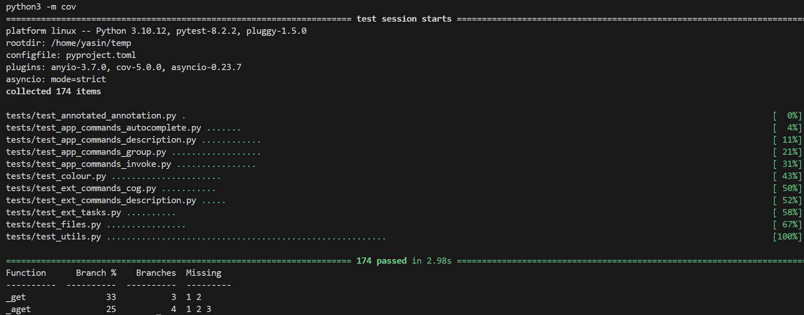

json_or_text

[commit](https://github.com/tthijm/sep/commit/c8f9434b7caa2fffe7a4b5d92a5af532f82bfb5e) +
[commit](https://github.com/tthijm/sep/commit/17c4a758b69a2f9fed324376e5388e50df7d8089)
Note: the second commmit is the final instrumentation

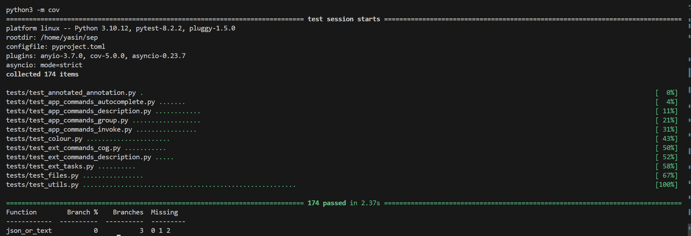

#### Frank

parse_rgb_number

[commit](https://github.com/tthijm/sep/commit/45156c574d1be11a2da25e0f74efe866d3e2cc97)

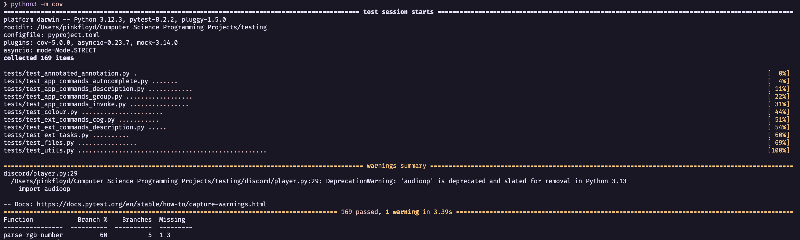

from_str

[commit](https://github.com/tthijm/sep/commit/51d176fb44faf01d429e81d5cbd5673fb4b42a8b)

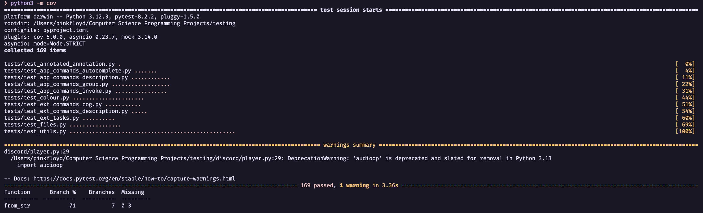

## Coverage improvement

### Individual tests

#### Thijmen

test_flatten_literal_params

[commit](https://github.com/tthijm/sep/commit/18e8104041610c32f9dedff6740688c4d1934550) + [commit](https://github.com/tthijm/sep/commit/138ca9a4c4b0a5f8fba254271f6b913b80d20b95)

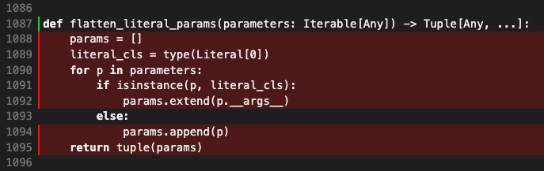

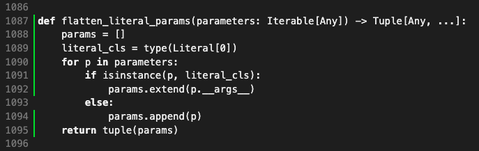

The coverage improvement is +100%.
The coverage has been improved, because `flatten_literal_params` used to not be tested, while the new `test_flatten_literal_params` considers every branch to be taken.

test\_\_human_join

[commit](https://github.com/tthijm/sep/commit/92796db0afb5feff4b51b3c7e4874c2ba0eae7b9)

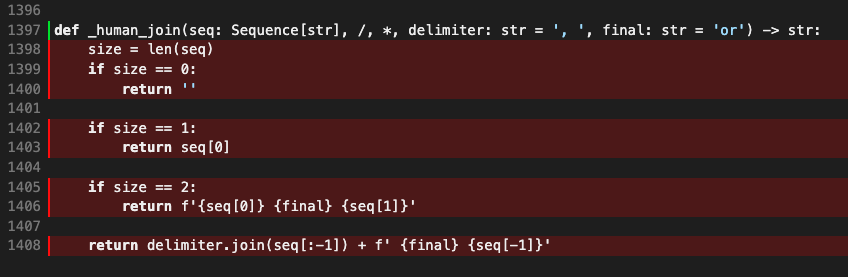

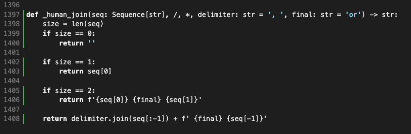

The coverage improvement is +100%.
The coverage has been improved, because `_human_join` used to not be tested, while the new `test__human_join` considers every branch to be taken.

#### Maurice

test_escape_markdown

[commit](https://github.com/tthijm/sep/commit/24b0b85075038a36dacd82dedc434a858ff342da)

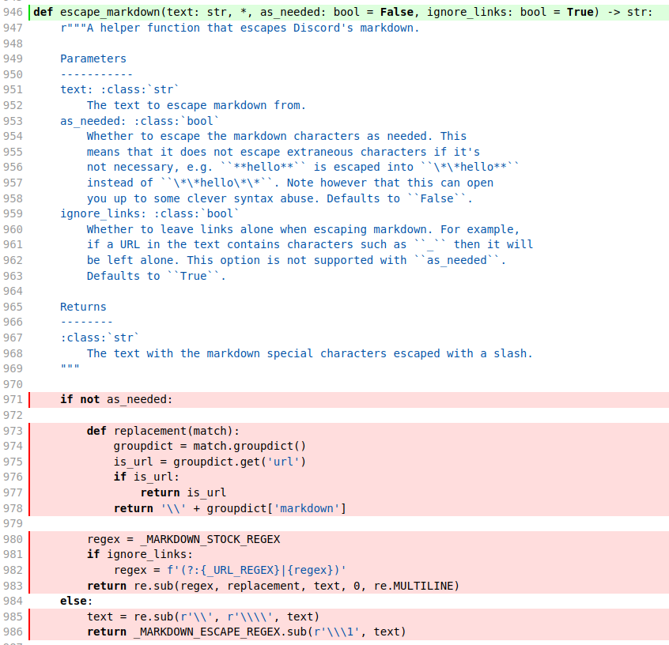

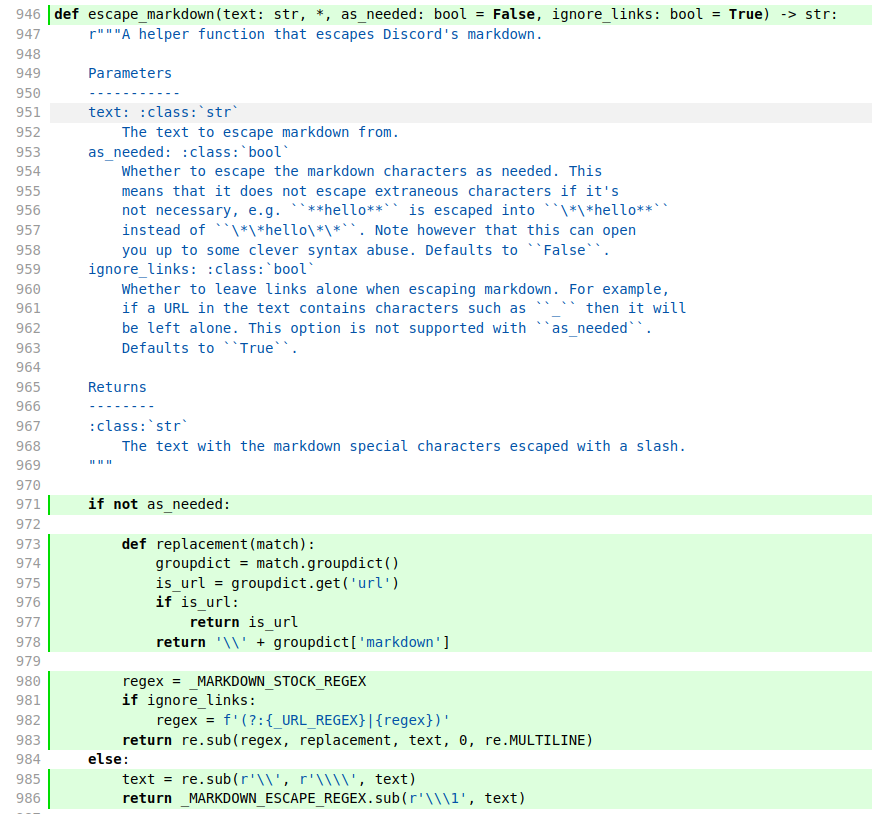

The coverage improvement is +100%.
The coverage has been improved, because `escape_markdown` used to not be tested, while the new `test_escape_markdown` considers every branch to be taken.

test_string_width

[commit](https://github.com/tthijm/sep/commit/1a5311c4eefde4af064bb28abed0b97659bfaee2)
[commit] (https://github.com/tthijm/sep/commit/fa81a81e90b4623bbaf7e9a2ee2d46e4f26556e9)

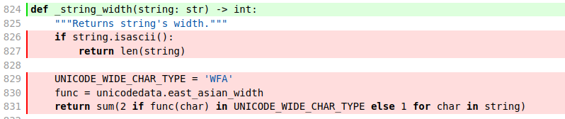

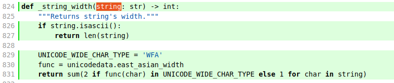

The coverage improvement is +100%.
The coverage has been improved, because `string_width` used to not be tested, while the new `string_width` considers every branch to be taken.

#### Yasin

test_get_find

[commit](https://github.com/tthijm/sep/commit/02cb0d7aebe7c96c9dc6d734c5a6056f08761565)

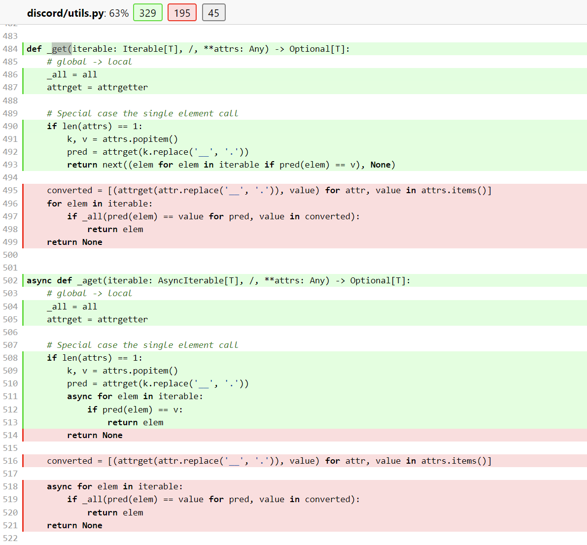

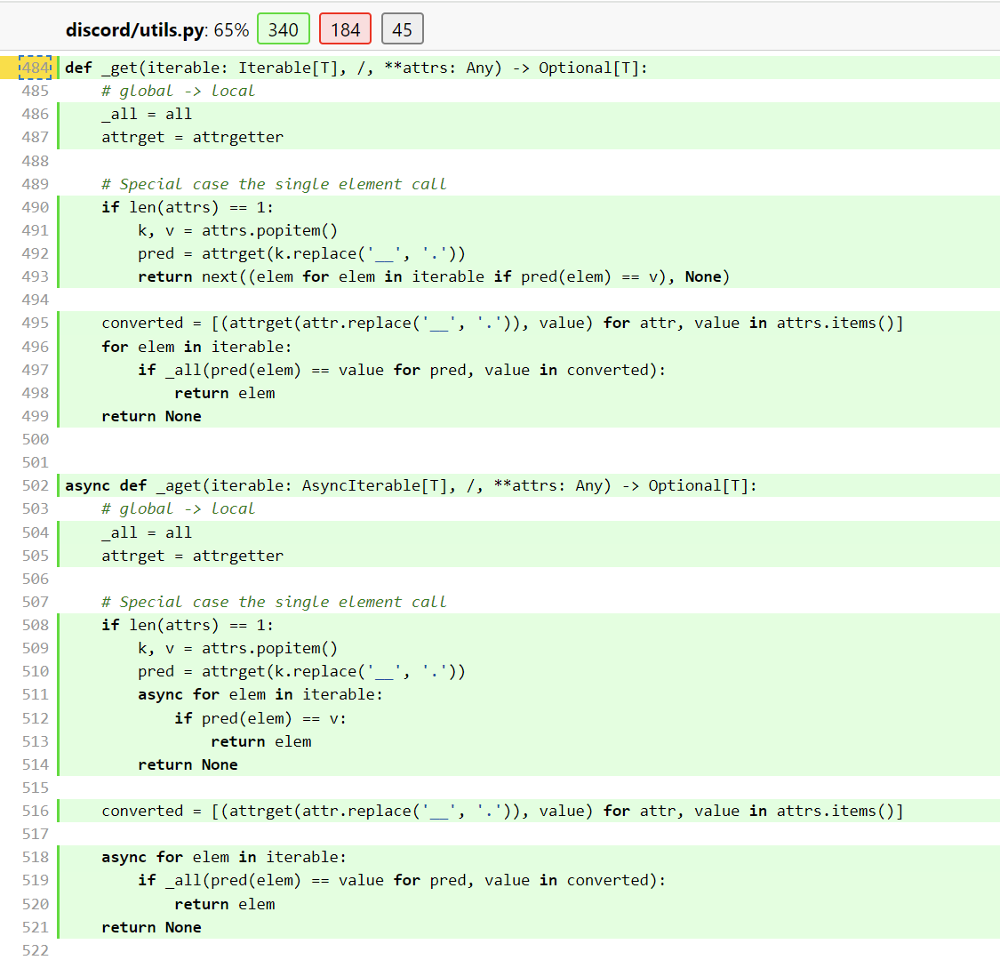

The coverage improvement is 88%.
The coverage has been improved, because the previous test_get_find only considered the sync and asyn get with single values. I extended the test so that it tests these functions with multiple attributes as well, this way it currently reaches more branches and therefore the coverage improved. Additionally the previous test did not consider the case where we loop through the array and we don't find the corresponding item we are looking for, we added this case by giving an empty array as argument, which causes the code to not enter the for loop and thus reach more branches.

test_json_or_text

[commit](https://github.com/tthijm/sep/commit/590afe1584d3e8f2dcc0a806202ddd4f2c4d7a69)

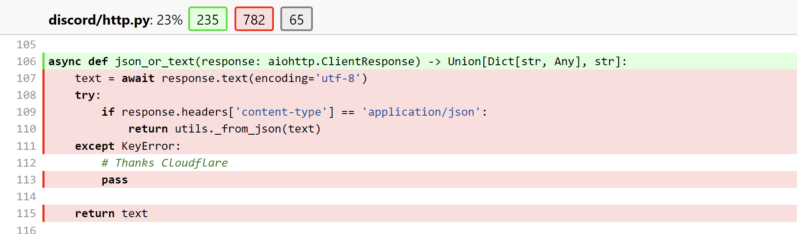

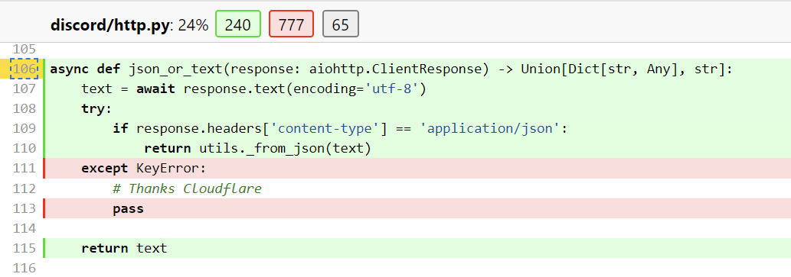

The coverage improvement is 71%.
The coverage has been improved, because the previously there was no test for json_or_text. I now added a test that considers two cases: one where the data is a json and one where the data is plain text. This way we reach two additional branches and thus the coverage improves.

#### Frank

test_from_str_failures

[commit](https://github.com/tthijm/sep/commit/51a7b35a9b4af8058cc9d513085b02306ae63a43)

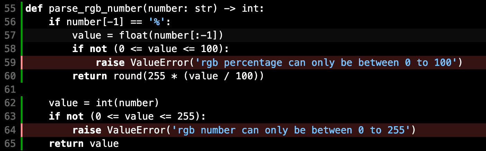

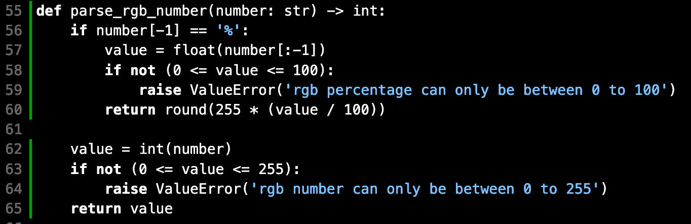

The coverage of the function has improved from the original 78% to 100%, since the other two branches (1 and 3) were also covered.

test_from_str_failures

[commit](https://github.com/tthijm/sep/commit/d5de3d9bd413d9ddab2facc30d57f3016284db57)

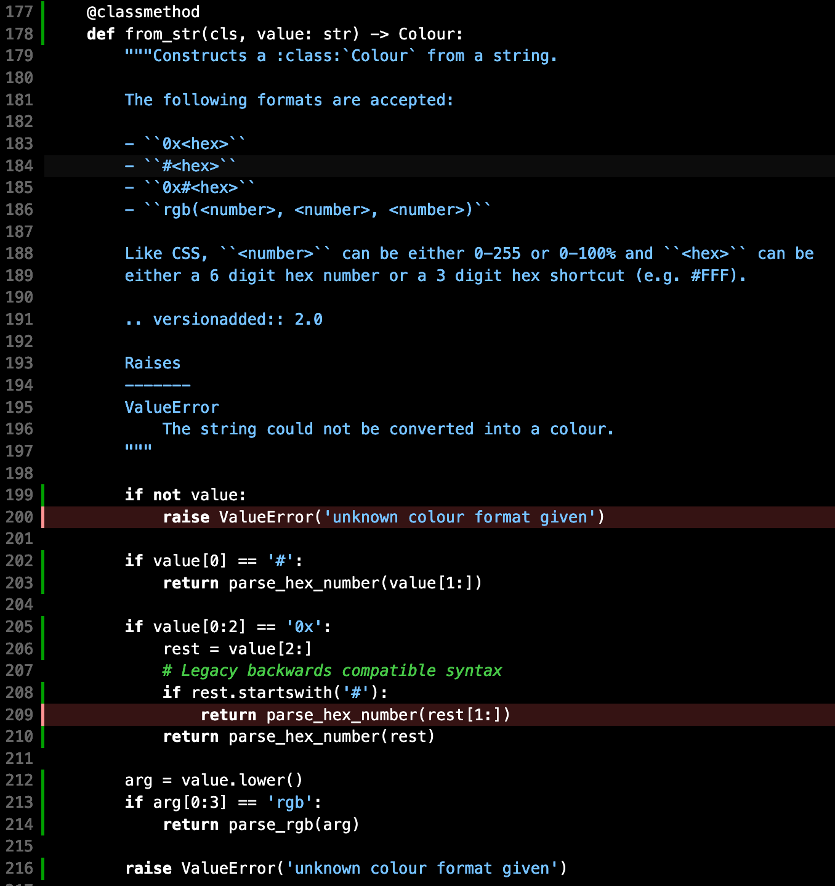

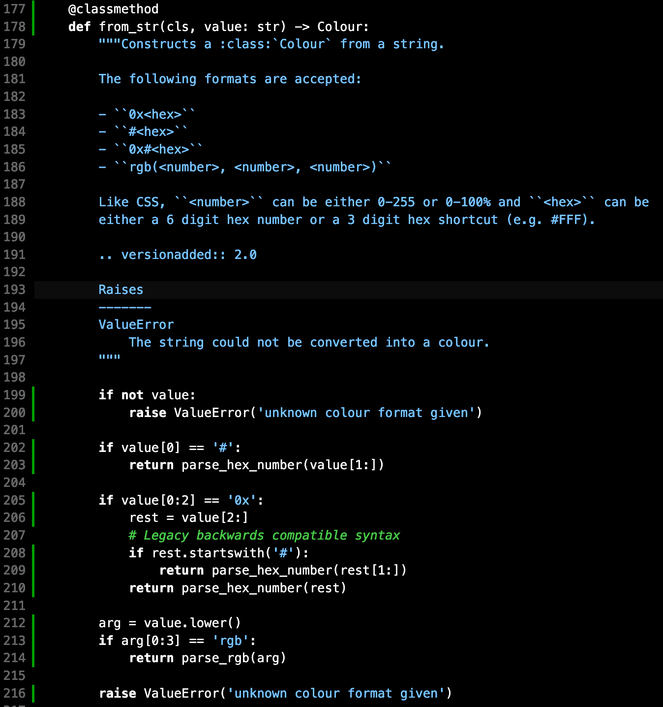

The coverage improved from 85% to 100%. Since the tests resulted in each of the if statements to trigger, each of the two missing branches were also covered.

### Overall

<Provide a screenshot of the old coverage results by running an existing tool (the same as you already showed above)>

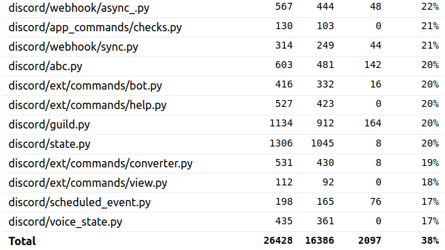

## Statement of individual contributions

<Write what each group member did>
